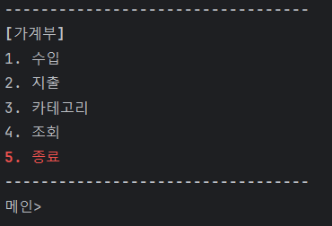
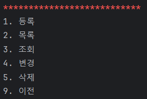
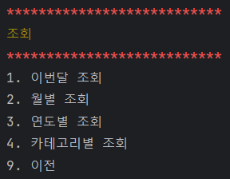

# 비트캠프 미니프로젝트 1

### 프로젝트 소개
- 주제 : 가계부 CLI 프로그램
- 개발기간 : 2024-06-27 ~ 2024-07-01

### 개발팀
- (NAVER Cloud) 클라우드 기반 웹 데브옵스 프로젝트 개발자 과정 14기
- 공통 : 설계, 테스트, 리팩터링
- backnback : 카테고리, TUI
- chocolithm (algo-itthm) : 지출, 조회
- seulki-k : 수입

<!-- 
  프로젝트 로고, 배포 주소
https://velog.io/@luna7182/%EB%B0%B1%EC%97%94%EB%93%9C-%ED%94%84%EB%A1%9C%EC%A0%9D%ED%8A%B8-README-%EC%93%B0%EB%8A%94-%EB%B2%95
 -->


<br><br>
# 시작 가이드

### Requirements
- JDK 21

### Installation
```
$ git clone "https://github.com/chocolithm/bitcamp-project1"
$ cd bitcamp-project1
```

### Run
```
$ java -cp app/bin/main bitcamp.project1.App
```

<!-- Backend, Frontend -->


<br><br>
# 기술 스택
<!-- https://github.com/Ileriayo/markdown-badges?tab=readme-ov-file#badges -->

### Environment


### Development


### Communication

<!-- 상황에 따라 config, test, deploy 등 추가 -->

<br><br>
# 프로젝트 구조
<pre>
📦src
┣ 📂main
┃ ┣ 📂java
┃ ┃ ┗ 📂bitcamp
┃ ┃ ┃ ┗ 📂project1
┃ ┃ ┃ ┃ ┣ 📂command
┃ ┃ ┃ ┃ ┃ ┣ 📜CategoryCommand.java
┃ ┃ ┃ ┃ ┃ ┣ 📜ExpenseCommand.java
┃ ┃ ┃ ┃ ┃ ┣ 📜IncomeCommand.java
┃ ┃ ┃ ┃ ┃ ┗ 📜StatisticsCommand.java
┃ ┃ ┃ ┃ ┣ 📂util
┃ ┃ ┃ ┃ ┃ ┣ 📜AbstractList.java
┃ ┃ ┃ ┃ ┃ ┣ 📜Highlight.java
┃ ┃ ┃ ┃ ┃ ┣ 📜LinkedList.java
┃ ┃ ┃ ┃ ┃ ┣ 📜List.java
┃ ┃ ┃ ┃ ┃ ┗ 📜Prompt.java
┃ ┃ ┃ ┃ ┣ 📂vo
┃ ┃ ┃ ┃ ┃ ┣ 📜Category.java
┃ ┃ ┃ ┃ ┃ ┣ 📜Expense.java
┃ ┃ ┃ ┃ ┃ ┗ 📜Income.java
┃ ┃ ┃ ┃ ┣ 📜App.java
┃ ┃ ┃ ┃ ┗ 📜Test1.java
┃ ┗ 📂resources
┃ ┃ ┗ 📜README.md
┗ 📂test
┃ ┣ 📂java
┃ ┃ ┗ 📂bitcamp
┃ ┃ ┃ ┗ 📂project1
┃ ┃ ┃ ┃ ┗ 📜AppTest.java
┃ ┗ 📂resources
┃ ┃ ┗ 📜README.md
</pre>


<br><br>
# 주요 기능

### 수입, 지출 및 카테고리 관리
- 날짜, 금액, 카테고리, 내용으로 수입 및 지출 관리
- 수입 및 지출별로 카테고리 관리

### 다양한 조회 기능 제공
- 이번달, 월별, 연도별 조회 가능
- 카테고리 기준 조회 제공


<br><br>
# 화면 구성

### 메인


### 수입, 지출, 카테고리


### 조회


<!-- 아키텍쳐 구조, 개발 일지, 회고 블로그 링크 -->